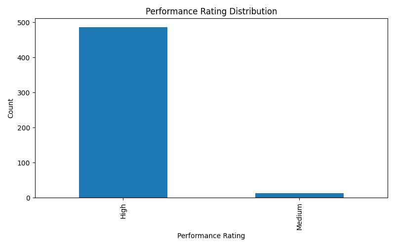
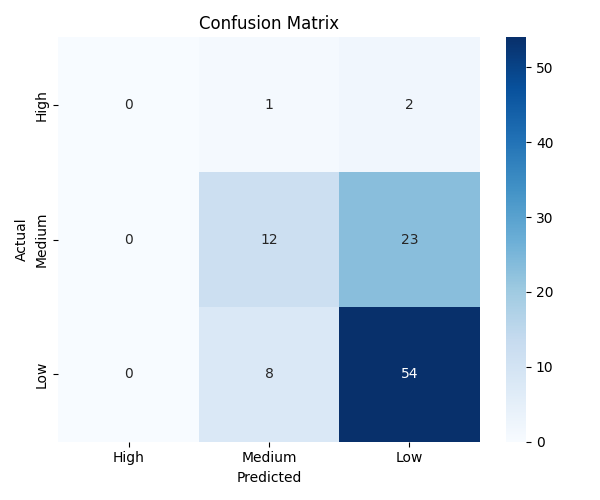
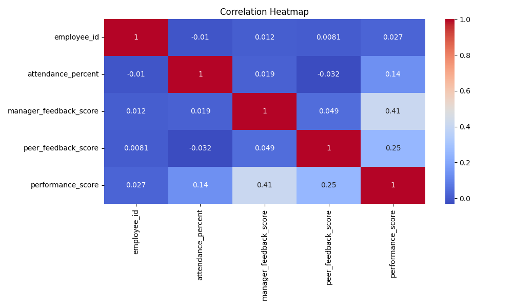
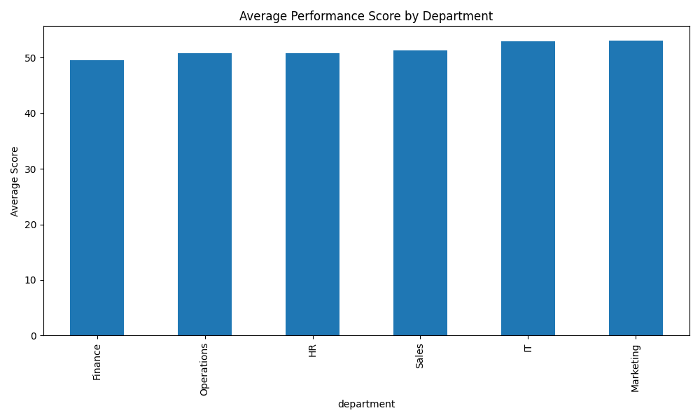
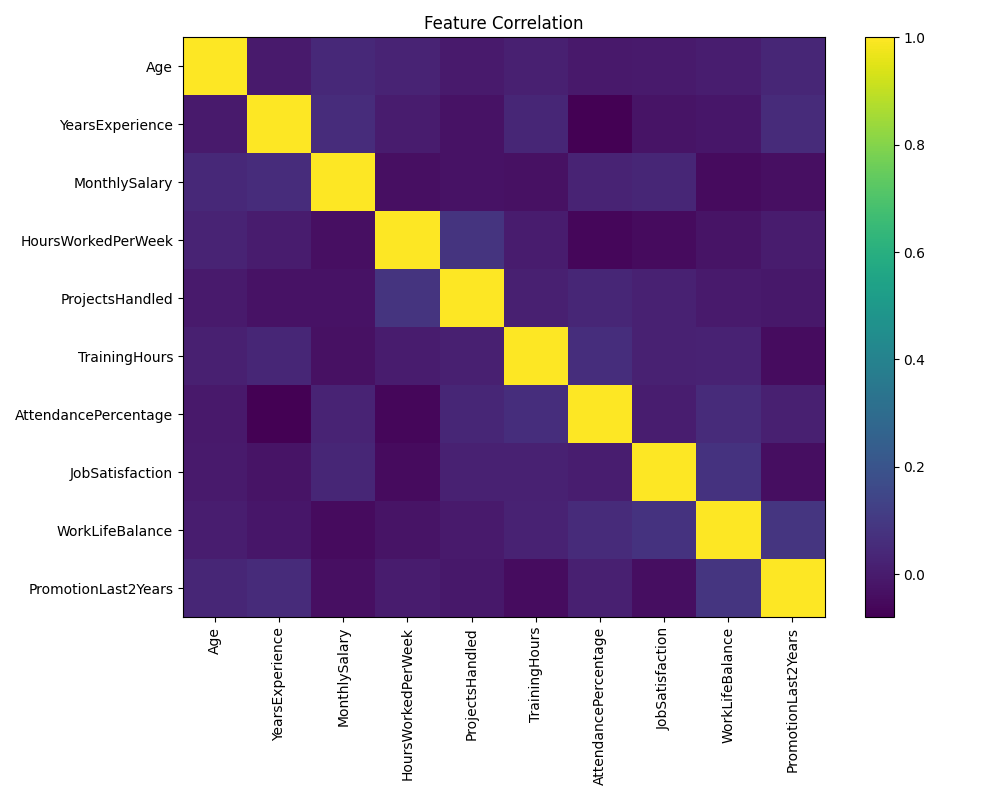
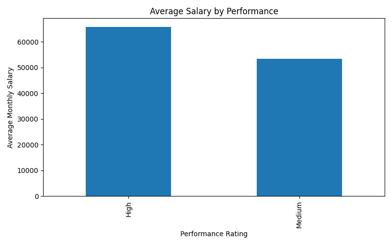
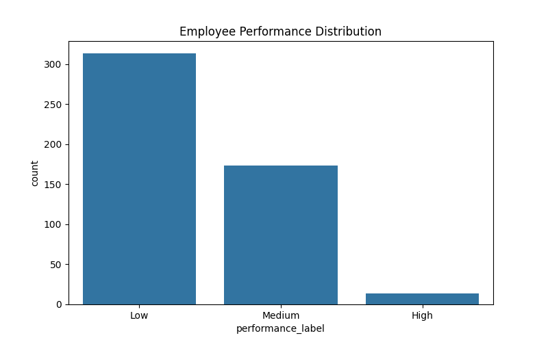

# 🚀 Employee Performance Predictor


---

## 📌 Overview

The **Employee Performance Predictor** is an end-to-end Machine Learning project that predicts whether an employee’s performance is:

👉 **Low | Medium | High**

based on HR, behavioral, and work-related features.

This project demonstrates a complete ML pipeline from **data generation → preprocessing → model training → evaluation → prediction → visualization**.

---

## 🧠 Problem Statement

Organizations struggle to evaluate employee performance objectively.

This project helps:

* Predict employee performance
* Understand key influencing factors
* Support HR decision-making

---

## ⚙️ Tech Stack

* **Python**
* **Pandas & NumPy**
* **Matplotlib**
* **Scikit-learn**
* **VS Code**

---

## 📂 Project Structure

```bash
Employee-Performance-Predictor/
│
├── data/
│   └── employee_data.csv
│
├── models/
│   └── employee_performance_model.pkl
│
├── outputs/
│   ├── class_distribution.png
│   ├── confusion_matrix.png
│   ├── correlation_heatmap.png
│   ├── department_performance.png
│   ├── feature_correlation.png
│   ├── performance_by_salary.png
│   ├── performance_distribution.png
│   └── model_metrics.txt
│
├── src/
│   ├── data_generator.py
│   ├── preprocessing.py
│   ├── eda.py
│   ├── train_model.py
│   └── predict.py
│
├── main.py
├── requirements.txt
└── README.md
```

---

## 📊 Features Used

* Age
* Gender
* Department
* Education
* Years of Experience
* Monthly Salary
* Hours Worked Per Week
* Projects Handled
* Training Hours
* Attendance Percentage
* Job Satisfaction
* Work-Life Balance
* Promotion in Last 2 Years

---

## 🤖 Model Used

### 🔹 Random Forest Classifier

Why?

* Handles structured data well
* Captures complex relationships
* Robust and accurate
* Beginner-friendly

---

## 🚀 How to Run the Project

### 1️⃣ Clone Repository

```bash
git clone https://github.com/mashalsoumya-cyber/Employee-Performance-Predictor.git
cd Employee-Performance-Predictor
```

### 2️⃣ Create Virtual Environment

```bash
python -m venv venv
```

### 3️⃣ Activate Environment

```bash
venv\Scripts\activate
```

### 4️⃣ Install Dependencies

```bash
pip install -r requirements.txt
```

### 5️⃣ Run Project

```bash
python main.py
```

---

## 📈 Outputs

### 🔹 Class Distribution



### 🔹 Confusion Matrix



### 🔹 Correlation Heatmap



### 🔹 Department Performance



### 🔹 Feature Correlation



### 🔹 Performance by Salary



### 🔹 Performance Distribution



---

## 🎯 Sample Prediction

```bash
Predicted Employee Performance: Medium
```

---

## 📊 Model Performance

* Accuracy: ~70% – 85%
* Balanced classification across all categories
* Improved using class balancing techniques

---

## 📚 Learning Outcomes

✔ Data Generation & Cleaning
✔ Feature Engineering
✔ Data Visualization
✔ Model Training & Evaluation
✔ Real-world ML Pipeline
✔ GitHub Project Deployment

---

## 🔮 Future Improvements

* 🌐 Streamlit Web App (UI for predictions)
* 📊 Feature Importance Visualization
* 📉 Model Comparison (XGBoost, SVM)
* ☁️ Deployment (Render / Streamlit Cloud)

---


